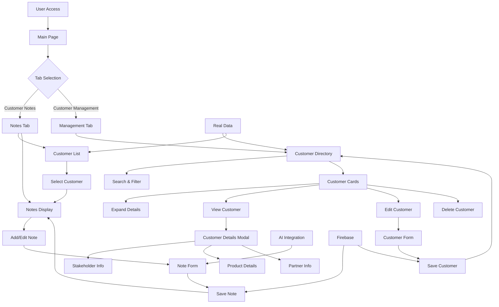
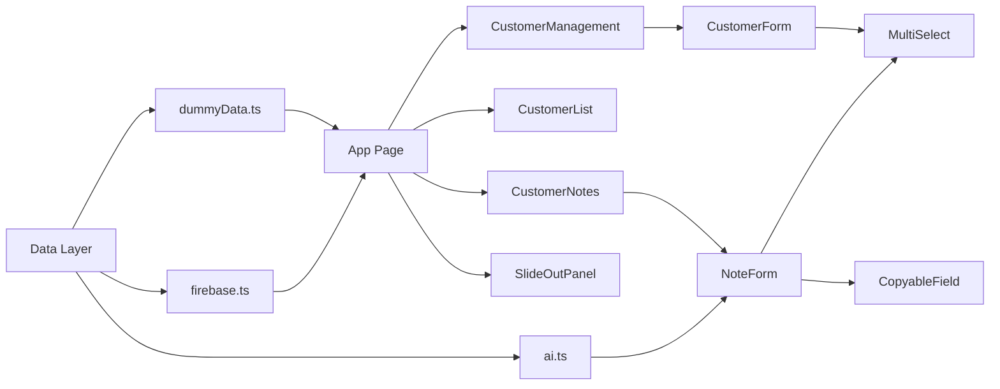
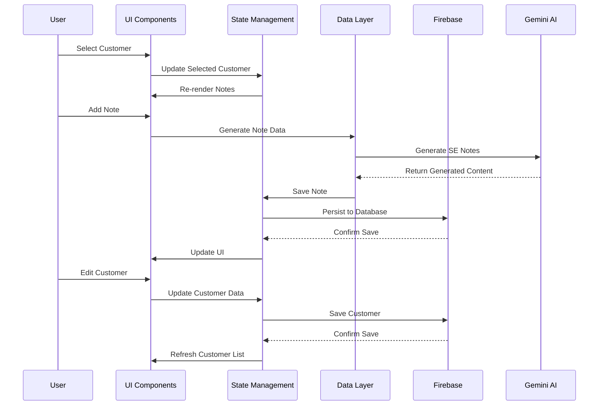
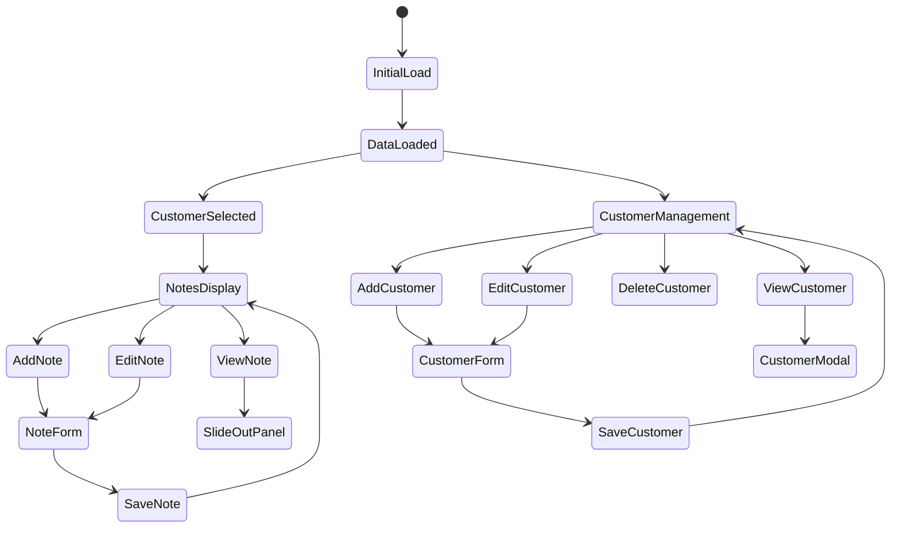
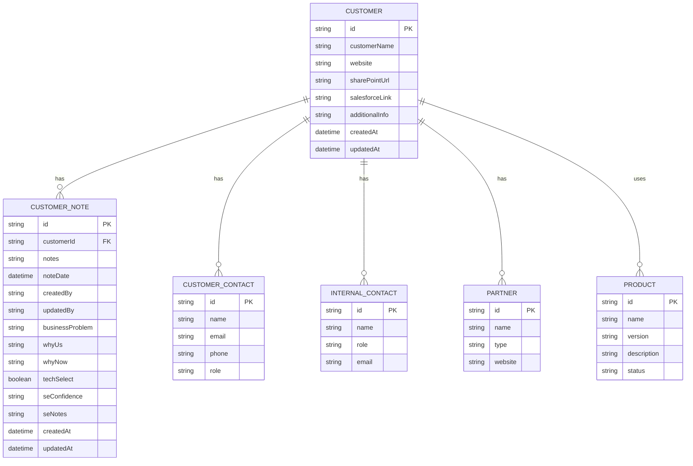
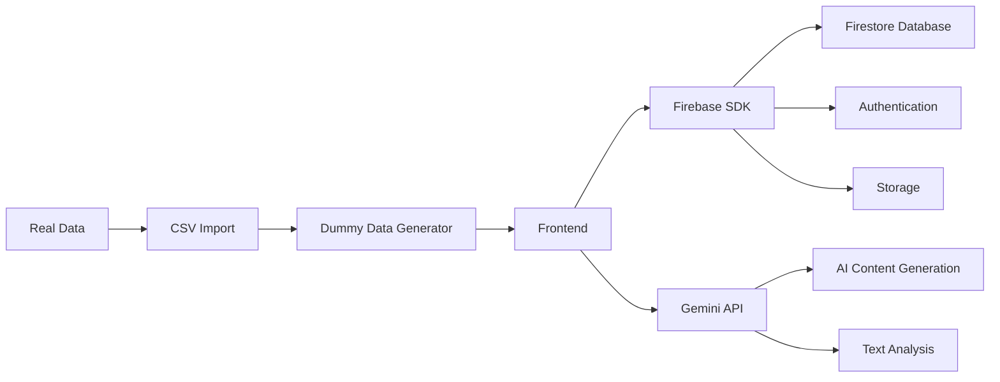
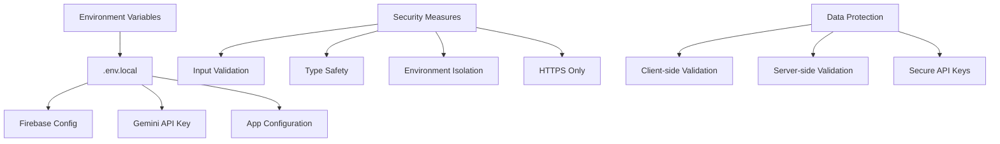
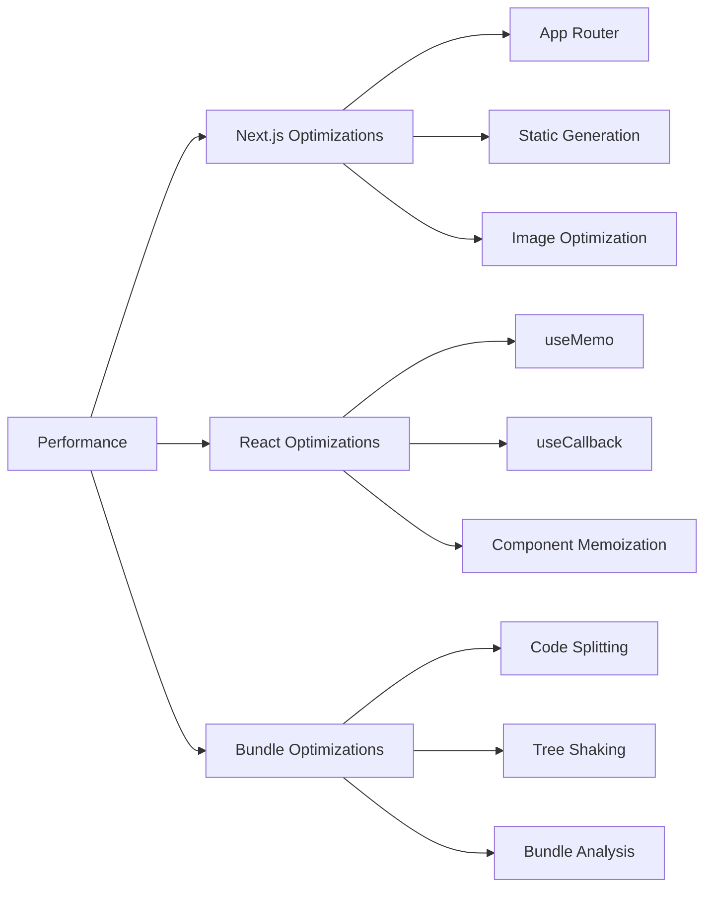
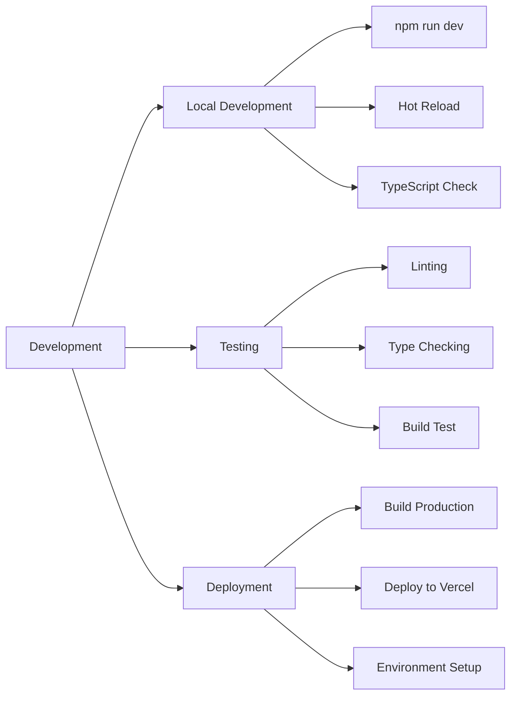
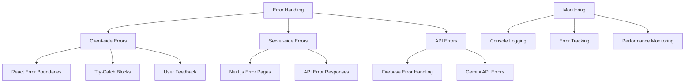

# Project Architecture & Flow Documentation

## Application Flow Diagram



## Component Architecture



## Data Flow



## State Management Flow



## Next.js App Router Structure

```
app/
├── layout.tsx          # Root layout with providers
├── page.tsx            # Main application page
├── globals.css         # Global styles
└── loading.tsx         # Loading UI (optional)
```

## React Component Hierarchy

```
App (page.tsx)
├── Header
│   ├── Title
│   ├── Stats Cards
│   └── Add Customer Button
├── Search & Filters
│   ├── Search Input
│   ├── Sort Dropdown
│   └── Sort Direction
├── Tab Navigation
│   ├── Customer Notes Tab
│   └── Customer Management Tab
├── Tab Content
│   ├── Customer Notes View
│   │   ├── CustomerList
│   │   └── CustomerNotes
│   └── Customer Management View
│       └── CustomerManagement
├── Modals
│   ├── CustomerForm
│   ├── NoteForm
│   └── Customer Details Modal
└── SlideOutPanel
```

## Data Models & Relationships



## API Integration Points



## Security & Environment



## Performance Optimizations



## Development Workflow



## Error Handling & Monitoring


