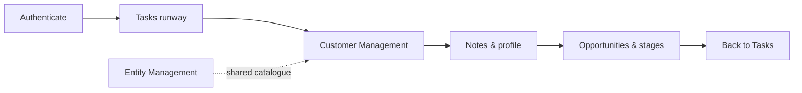
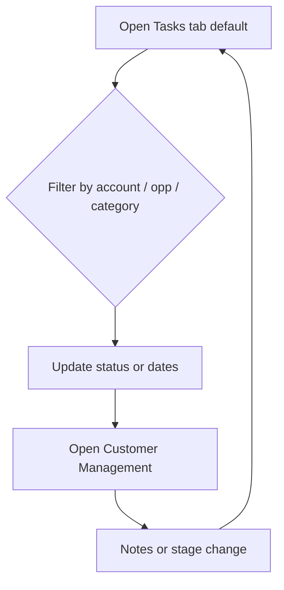
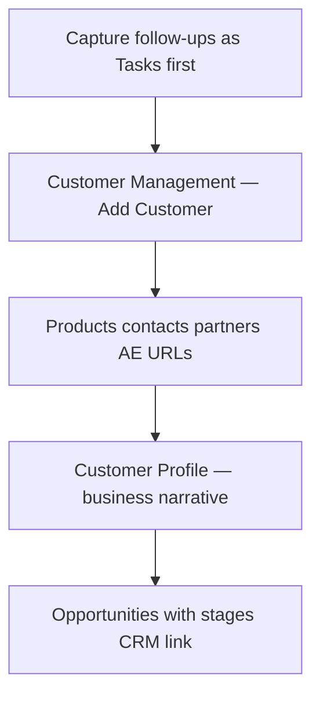
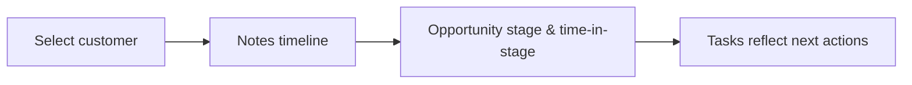
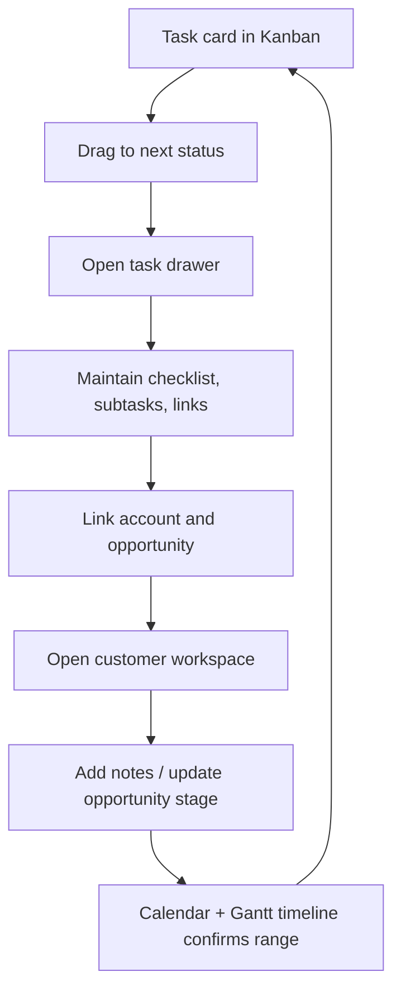

# Customer Engagement Journey

This describes how Solution Engineers (SEs), Account Executives (AEs), and operators move through **Customer Engagement Hub** from first login to recurring account care. It complements the procedural steps in [USER_GUIDE.md](USER_GUIDE.md). Opportunity stage semantics and CRM alignment are documented in **[OPPORTUNITY_STAGES.md](OPPORTUNITY_STAGES.md)**.

**Last updated:** May 2026

---

## 1. Roles and goals

| Actor | Typical goals |
|--------|----------------|
| SE / Solution Consultant | Run the weekly task runway, understand the account, log notes, collaborate on demos |
| AE / SAM | Pipeline visibility, stage hygiene, escalation paths |
| Any authenticated user | Central source of truth: **tasks**, customers, notes, opportunities, catalogue entities |

Firestore scopes work to **`request.auth`**; all journey steps assume a signed-in user.

---

## 2. Journey map — tasks at the forefront

The workspace **defaults to Tasks & Kanban** so planning and execution stay visible.

- **Tasks first:** Board and calendar anchor the week; link accounts and optionally opportunities so the same work appears on the customer record.
- **Customer as hub:** Notes, profiles, opportunities, and “last actioned” indicators connect to linked tasks ([FEATURES.md](FEATURES.md)).
- **Entity catalogue:** Products, contacts, partners — maintain under Entity Management **when you have time**, not strictly before logging tasks.
- **AI:** Accelerator for summaries and structured edits once baseline data exists.

---

## 3. Detailed flows

### A. Warm start (operators)

### B. Discovery and onboarding a new logo

### C. Ongoing cadence per account

**Time in stage** and history are described in **[OPPORTUNITY_STAGES.md](OPPORTUNITY_STAGES.md)**.

### E. Task execution flow (board + timeline)

This is the default operating loop for active accounts like BUPA:

- **Kanban** is execution-first: drag card across statuses (`todo` → `in_progress` → `done`/`cancelled`).
- **Calendar month grid** gives day-level visibility.
- **Gantt timeline lane** gives range-level visibility for long-running tasks (e.g., May 5–14 prep windows).
- **Task links** (Loop, Salesforce, SharePoint) keep context attached to execution, not buried in notes.

### D. Data removal (lifecycle end)

Deleting a customer or opportunity triggers **cleanup of linked engagement tasks** via domain logic (`src/domain/engagement-hub/taskRemoval.ts`).

---

## 4. Where each tab fits

| Area | Journey role |
|------|----------------|
| **Tasks & Kanban** | **Operational front door** — board, calendar, filters, linkage to accounts and opportunities |
| **Customer Management** | Account cockpit — notes, profiles, opportunities, task-derived activity |
| **Entity Management** | Shared vocabulary — contacts, roster, products, partners, martech |
| **Migration Opportunities** | Focused migration roster → links into Customer Management |

---

## 5. Relation to architecture

The dashboard loads a workspace snapshot via **`GET /api/workspace`**. Mutations use **`POST` / `PUT` / `PATCH` / `DELETE`** on **`/api/*`** with a Firebase Bearer token ([ARCHITECTURE.md](ARCHITECTURE.md)). Pure business rules (open tasks, cascaded deletes) live under **`src/domain/engagement-hub/`**.

---

## 6. Further reading

- [USER_GUIDE.md](USER_GUIDE.md)
- **[OPPORTUNITY_STAGES.md](OPPORTUNITY_STAGES.md)** — stages, CRM hints, **time in stage**
- [FEATURES.md](FEATURES.md)
- [ARCHITECTURE.md](ARCHITECTURE.md)
- [SCRIPTS.md](SCRIPTS.md)
